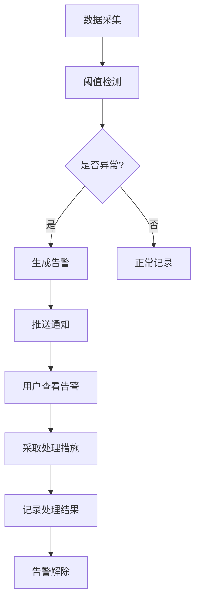

# 淡水池塘智慧养殖管控平台 - 产品需求文档

## 1. 产品概述

淡水池塘智慧养殖管控平台是面向水产养殖合作社、家庭农场和技术人员的一体化智慧管理系统，通过物联网、大数据和智能控制技术，实现鱼塘水质监测、设备远程控制、生产过程管理和经营分析，提升养殖效率，降低养殖风险，助力水产养殖数字化转型。

- 核心目标：实现养殖过程的可视化、智能化、精细化管理
- 目标用户：水产养殖合作社、家庭农场主、水产技术人员
- 市场价值：推动传统水产养殖向智慧养殖升级，提高产量和效益

## 2. 核心功能

### 2.1 用户角色

| 角色 | 注册方式 | 核心权限 |
|------|----------|----------|
| 合作社管理员 | 平台注册 | 全平台管理权限，查看所有塘口数据，设备控制，经营分析 |
| 家庭农场主 | 平台注册 | 管理自有塘口，查看设备状态，填报生产记录 |
| 技术员 | 平台邀请 | 巡查记录填报，病害诊断建议，技术指导记录 |

### 2.2 功能模块

1. **监控首页**：池塘地图概览、关键水质指标、设备运行状态、实时告警
2. **塘口管理**：塘口档案、苗种投放、采样检测、病害处置、巡塘记录
3. **设备控制**：增氧机状态监控与控制、自动投饵设置、水质监测设备管理
4. **巡检填报**：巡塘记录、水质采样、病害观察、日常作业记录
5. **投入品管理**：饵料库存、药品管理、苗种管理、出入库记录
6. **经营分析**：产量预估、成本收益分析、客户订单、用工登记
7. **预警处理**：异常告警列表、告警处理记录、阈值设置

### 2.3 页面详情

| 页面名称 | 模块名称 | 功能描述 |
|---------|----------|----------|
| 监控首页 | 池塘地图 | 可视化展示所有塘口位置和状态，支持点击查看详情 |
| 监控首页 | 水质概览 | 展示水温、溶氧、氨氮、pH值等关键指标实时数据和趋势 |
| 监控首页 | 设备状态 | 增氧机、投饵机等设备运行状态一览，支持快捷控制 |
| 监控首页 | 实时告警 | 展示最新异常告警信息，支持快速处理 |
| 塘口管理 | 塘口档案 | 塘口基本信息、面积、水深、养殖品种等基础档案管理 |
| 塘口管理 | 苗种投放 | 记录苗种投放时间、品种、数量、规格等信息 |
| 塘口管理 | 采样检测 | 水质采样检测记录，包括各项指标检测结果 |
| 塘口管理 | 病害处置 | 病害发生记录、诊断结果、用药方案、治疗效果跟踪 |
| 塘口管理 | 巡塘记录 | 日常巡塘记录，包括观察情况、异常发现、处理措施 |
| 设备控制 | 增氧机管理 | 增氧机状态监控、远程开关控制、定时任务设置 |
| 设备控制 | 自动投饵 | 投饵机参数设置、投喂计划、投喂记录查询 |
| 设备控制 | 水质监测 | 监测设备列表、校准记录、数据趋势分析 |
| 巡检填报 | 巡塘填报 | 移动端友好的巡塘记录表单，支持图片上传 |
| 巡检填报 | 采样填报 | 水质采样数据录入，支持多个指标批量录入 |
| 投入品管理 | 饵料库存 | 饵料出入库管理、库存预警、消耗统计 |
| 投入品管理 | 药品管理 | 渔药库存管理、用药记录、保质期提醒 |
| 经营分析 | 成本收益 | 养殖成本统计、收益分析、利润率计算 |
| 经营分析 | 产量预估 | 基于生长模型和历史数据的产量预测 |
| 经营分析 | 客户订单 | 订单管理、发货记录、应收款项 |
| 经营分析 | 用工登记 | 工人出勤记录、工资计算、人工成本统计 |
| 预警处理 | 告警列表 | 所有异常告警信息，按级别分类展示 |
| 预警处理 | 告警处理 | 告警确认、处理措施记录、处理结果跟踪 |
| 预警处理 | 阈值设置 | 各项指标告警阈值自定义配置 |

## 3. 核心流程

### 3.1 日常监控流程
用户登录平台 → 查看监控首页概览 → 检查水质指标是否正常 → 查看设备运行状态 → 处理待处理告警 → 进入具体塘口查看详情

### 3.2 巡塘记录流程
技术员打开巡塘填报 → 选择塘口 → 记录观察情况 → 上传现场照片 → 记录异常发现 → 提交巡塘记录 → 系统自动关联塘口档案

### 3.3 告警处理流程
系统检测到异常指标 → 生成告警信息并推送 → 用户收到告警通知 → 查看告警详情 → 采取处理措施（如开启增氧机）→ 记录处理结果 → 告警解除

## 4. 用户界面设计

### 4.1 设计风格

**设计主题**：科技蓝 + 自然绿，体现智慧科技与水产养殖的结合

- **主色调**：深海蓝 (#0C4A6E) - 代表水和科技感
- **辅助色**：水草绿 (#059669) - 代表生命和健康
- **警示色**：珊瑚红 (#DC2626) - 告警提示
- **背景色**：浅灰蓝 (#F0F9FF) - 清爽的界面背景
- **中性色**：深灰 (#1F2937)、中灰 (#6B7280)、浅灰 (#F3F4F6)

**设计风格**：
- 卡片式布局，圆角设计，阴影柔和
- 数据可视化采用渐变色彩，增强视觉层次
- 图标采用线性风格，简洁现代
- 字体使用思源黑体，清晰易读
- 微动效：卡片悬浮效果、数据加载动画、状态切换过渡

### 4.2 页面设计概览

| 页面名称 | 模块名称 | UI元素 |
|---------|----------|--------|
| 监控首页 | 池塘地图 | 交互式地图，塘口标记点，状态颜色编码，悬浮tooltip |
| 监控首页 | 水质卡片 | 大字号数值展示，趋势小图表，状态指示色条 |
| 监控首页 | 设备列表 | 设备图标，运行状态指示灯，快捷开关按钮 |
| 监控首页 | 告警面板 | 告警级别色标，时间线布局，快捷处理按钮 |
| 塘口管理 | 塘口列表 | 表格+卡片双视图，筛选搜索，状态标签 |
| 塘口管理 | 详情页 | 标签页布局，时间线记录，数据图表 |
| 设备控制 | 控制面板 | 设备仪表盘，开关控件，参数滑块，定时设置 |
| 经营分析 | 数据看板 | 多种图表类型（折线、柱状、饼图），数据钻取 |
| 预警处理 | 告警中心 | 分级列表，筛选器，批量操作，处理进度 |

### 4.3 响应式设计

- **桌面优先**：1920px宽度优化，支持1366px及以上屏幕
- **平板适配**：1024px宽度，侧边栏可折叠，图表自适应
- **移动适配**：768px以下，底部导航栏，单列布局，表单优化
- **触控优化**：按钮最小尺寸44px，滑动操作支持

### 4.4 数据可视化设计

- 水质指标使用仪表盘+趋势图组合展示
- 设备状态使用实时数据流动画
- 经营数据使用可交互图表，支持时间段筛选
- 地图使用自定义图标，不同状态使用不同颜色标记
