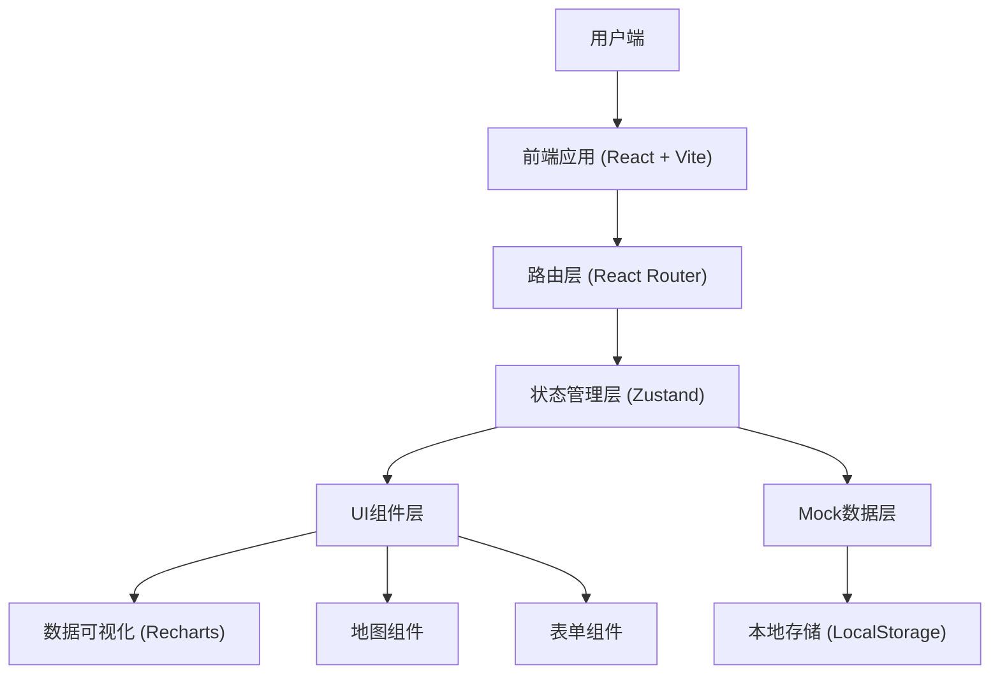

# 淡水池塘智慧养殖管控平台 - 技术架构文档

## 1. 架构设计



## 2. 技术描述

### 2.1 前端技术栈
- **框架**: React@18 - 组件化开发，高效的虚拟DOM
- **构建工具**: Vite@5 - 快速的开发服务器和构建
- **样式方案**: Tailwind CSS@3 - 原子化CSS，快速开发
- **路由**: React Router@6 - 单页应用路由管理
- **状态管理**: Zustand@4 - 轻量级状态管理
- **图表库**: Recharts@2 - React数据可视化组件
- **图标**: Lucide React - 现代化图标库
- **日期处理**: date-fns - 轻量级日期工具库
- **UI组件**: 自定义组件库，基于Tailwind CSS构建

### 2.2 数据方案
- **Mock数据**: 内置完整的模拟数据，包含所有业务模块
- **数据持久化**: LocalStorage存储用户配置和操作记录
- **实时模拟**: 使用定时器模拟实时数据更新

### 2.3 项目结构
```
src/
├── assets/           # 静态资源
├── components/       # 公共组件
│   ├── charts/      # 图表组件
│   ├── layout/      # 布局组件
│   ├── ui/          # 基础UI组件
│   └── maps/        # 地图相关组件
├── pages/           # 页面组件
│   ├── Dashboard/   # 监控首页
│   ├── Pond/        # 塘口管理
│   ├── Device/      # 设备控制
│   ├── Inspection/  # 巡检填报
│   ├── Inventory/   # 投入品管理
│   ├── Analysis/    # 经营分析
│   └── Alert/       # 预警处理
├── store/           # 状态管理
├── data/            # Mock数据
├── utils/           # 工具函数
├── types/           # TypeScript类型定义
├── hooks/           # 自定义Hooks
├── App.tsx
├── main.tsx
└── index.css
```

## 3. 路由定义

| 路由路径 | 页面名称 | 模块说明 |
|---------|----------|----------|
| / | 监控首页 | 池塘地图、水质概览、设备状态、实时告警 |
| /pond | 塘口管理 | 塘口列表、塘口详情、苗种投放、采样检测 |
| /pond/:id | 塘口详情 | 塘口档案、历史数据、相关记录 |
| /device | 设备控制 | 增氧机管理、自动投饵、水质监测设备 |
| /inspection | 巡检填报 | 巡塘记录填报、采样数据录入 |
| /inventory | 投入品管理 | 饵料库存、药品管理、出入库记录 |
| /analysis | 经营分析 | 成本收益、产量预估、订单管理、用工登记 |
| /alert | 预警处理 | 告警列表、告警处理、阈值设置 |

## 4. 核心数据模型

### 4.1 塘口数据模型
```typescript
interface Pond {
  id: string;
  name: string;
  area: number;        // 面积(亩)
  depth: number;       // 平均水深(米)
  breed: string;       // 养殖品种
  stockDate: string;   // 放苗日期
  location: {
    lat: number;
    lng: number;
  };
  status: 'normal' | 'warning' | 'danger';
  devices: Device[];
  waterQuality: WaterQuality;
}
```

### 4.2 水质数据模型
```typescript
interface WaterQuality {
  pondId: string;
  timestamp: string;
  temperature: number;  // 水温(°C)
  dissolvedOxygen: number; // 溶氧(mg/L)
  ph: number;          // pH值
  ammoniaNitrogen: number; // 氨氮(mg/L)
  nitrite: number;     // 亚硝酸盐(mg/L)
  transparency: number; // 透明度(cm)
}
```

### 4.3 设备数据模型
```typescript
interface Device {
  id: string;
  pondId: string;
  name: string;
  type: 'aerator' | 'feeder' | 'sensor';
  status: 'running' | 'stopped' | 'fault';
  power: number;       // 功率(kW)
  runtime: number;     // 累计运行时间(小时)
  lastMaintenance: string;
}
```

### 4.4 告警数据模型
```typescript
interface Alert {
  id: string;
  pondId: string;
  type: 'water_quality' | 'device' | 'system';
  level: 'info' | 'warning' | 'danger';
  message: string;
  timestamp: string;
  status: 'pending' | 'processing' | 'resolved';
  handler?: string;
  handleTime?: string;
  handleNote?: string;
}
```

## 5. 核心组件设计

### 5.1 布局组件
- **Sidebar**: 侧边导航栏，支持折叠
- **Header**: 顶部导航，用户信息、通知中心
- **MainLayout**: 主布局容器
- **Card**: 通用卡片容器

### 5.2 数据可视化组件
- **GaugeChart**: 仪表盘组件，展示水质指标
- **TrendChart**: 趋势折线图
- **StatusBadge**: 状态标签组件
- **PondMap**: 池塘地图组件，支持交互式标记

### 5.3 业务组件
- **WaterQualityCard**: 水质指标卡片
- **DeviceControl**: 设备控制组件
- **AlertList**: 告警列表组件
- **Timeline**: 时间线记录组件

## 6. 样式设计规范

### 6.1 设计令牌
```css
:root {
  --color-primary: #0C4A6E;
  --color-primary-light: #0369A1;
  --color-secondary: #059669;
  --color-danger: #DC2626;
  --color-warning: #D97706;
  --color-success: #059669;
  --color-bg: #F0F9FF;
  --color-card: #FFFFFF;
  --color-text-primary: #1F2937;
  --color-text-secondary: #6B7280;
  --radius-lg: 12px;
  --radius-md: 8px;
  --shadow-md: 0 4px 6px -1px rgba(0, 0, 0, 0.1);
  --shadow-lg: 0 10px 15px -3px rgba(0, 0, 0, 0.1);
}
```

### 6.2 响应式断点
- sm: 640px
- md: 768px
- lg: 1024px
- xl: 1280px
- 2xl: 1536px

## 7. 性能优化策略

1. **代码分割**: 按路由进行代码分割，懒加载页面组件
2. **按需加载**: 图表组件按需引入
3. **状态优化**: 合理划分状态粒度，避免不必要的重渲染
4. **列表虚拟化**: 长列表使用虚拟滚动
5. **图片优化**: 使用WebP格式，懒加载图片
6. **缓存策略**: 利用React Query进行数据缓存（可选）

## 8. 开发规范

### 8.1 命名规范
- 组件名: PascalCase (e.g., PondMap)
- 文件名: PascalCase (e.g., PondMap.tsx)
- 变量/函数: camelCase
- 常量: UPPER_SNAKE_CASE
- 类型/接口: PascalCase，I前缀可选

### 8.2 目录规范
- 每个页面独立文件夹
- 公共组件放置在components目录
- 业务逻辑优先使用自定义Hooks
- 工具函数按功能分类放置

### 8.3 Git提交规范
- feat: 新功能
- fix: 修复bug
- docs: 文档更新
- style: 代码格式调整
- refactor: 重构
- perf: 性能优化
- test: 测试相关
